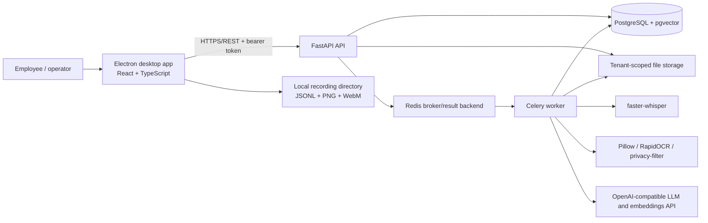
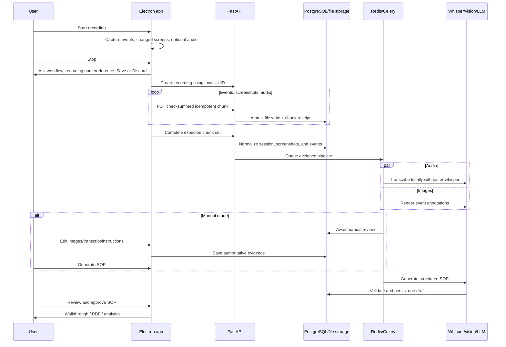

# WorkTrace AI — Client Requirements and Implementation Report

**Project:** 27 — Workforce Intelligence  
**Client:** Dr. Lamont Tang  
**Repository reviewed:** WorkTrace/Project 79 (`frappe`)  
**Code baseline:** `73ab49e` (`main`, 3 August 2026), plus the current working tree  
**Report date:** 3 August 2026  
**Assessment method:** Source-code, schema, migration, API, UI, worker, test, and deployment-configuration review

---

## Contents

1. [Purpose of this report](#1-purpose-of-this-report)
2. [Executive summary](#2-executive-summary)
3. [Current system architecture](#3-current-system-architecture)
4. [Technology stack](#4-technology-stack)
5. [Module 1 — Workflow Recorder](#5-module-1--workflow-recorder)
6. [Module 2 — AI SOP Generator](#6-module-2--ai-sop-generator)
7. [Module 3 — Onboarding Walkthrough](#7-module-3--onboarding-walkthrough)
8. [Module 4 — Voice Feedback Layer](#8-module-4--voice-feedback-layer)
9. [Module 5 — Workflow Variance Dashboard](#9-module-5--workflow-variance-dashboard)
10. [Data architecture, privacy, and security](#10-data-architecture-privacy-and-security)
11. [Additional product capabilities](#11-additional-product-capabilities-beyond-the-brief)
12. [Backend API inventory](#12-backend-api-inventory)
13. [Data model](#13-data-model)
14. [Requirement traceability matrix](#14-requirement-traceability-matrix)
15. [Testing and verification evidence](#15-testing-and-verification-evidence)
16. [Deployment and operational readiness](#16-deployment-and-operational-readiness)
17. [Known inconsistencies and technical debt](#17-known-inconsistencies-and-technical-debt)
18. [Prioritized completion plan](#18-prioritized-completion-plan)
19. [Final assessment](#19-final-assessment)

---

## 1. Purpose of this report

This report compares the current WorkTrace implementation with the requirements supplied by the client. It explains what has been built, how it works, which technologies and design approaches were used, where the implementation intentionally differs from the brief, and what remains incomplete.

The report is based on the status of code in the repository on 3 August 2026.

- the requested Chrome extension was intentionally replaced by a full Electron desktop recorder;
- workflow grouping, manual evidence editing, AI redaction, PDF export, search, service monitoring, and versioned analytics were added beyond the original module descriptions;
- analytics now provides both a 2–5 recording semantic comparison and a 6–50 recording workforce mode with deterministic K-means clustering and friction analysis;
- generated SOP drafts now have direct structured editing, optimistic concurrency, immutable approvals, and revision history;


The status labels used throughout are:

- **Implemented:** the requirement is represented end to end in the current code.
- **Partially implemented:** reusable pieces exist, but the client-described experience is not complete.
- **Not implemented:** no working end-to-end implementation was found.
- **Changed by product decision:** the original mechanism was deliberately replaced with a different one.

---

## 2. Executive summary

WorkTrace is now a substantial desktop-first workflow-intelligence prototype. The strongest completed path is:

1. a signed-in employee starts a native desktop recording;
2. global input events, change-triggered screenshots, and optional microphone audio are captured locally;
3. the recording is named, assigned to a new or existing workflow, given an optional reference, and uploaded with checksummed, idempotent chunks;
4. the backend normalizes the evidence and dispatches transcription and annotation to Celery workers;
5. the user can manually review and alter screenshots, transcript, and SOP instructions;
6. an OpenAI-compatible model generates a validated structured SOP;
7. the generated draft can be edited step-by-step, saved with revision protection, approved, exported as PDF, and played in a floating walkthrough window;
8. approved recordings can be compared in a selected 2–5 view or analyzed as a 6–50 recording workforce population with path clusters and friction.

The project therefore delivers most of the intended **record → codify → review → approve → coach → compare** product loop. It also includes several important additions not requested explicitly in the original brief: authentication, tenant-aware workflow folders, a manual annotation editor, on-demand AI screenshot redaction, signed media URLs, service-health diagnostics, global search, retry controls, a separate image viewer, local evidence caching, and a configurable OpenRouter-compatible LLM provider.

The main gaps against the client brief are:

1. **Module 1 form factor:** recording is implemented as an Electron desktop application, not a Manifest V3 Chrome extension. This was a deliberate scope change and enables whole-desktop capture, but it is still a formal deviation.

2. **Project deliverables:** code, Docker development infrastructure, OpenAPI, migrations, and AWS planning exist; the three market-test reports, commercial pitch deck, individual reflections, and formal live-demo package were not found.

### Overall module assessment

| Client module | Current status | Summary |
|---|---|---|
| Module 1 — Workflow Recorder | **Changed by product decision / implemented** | Electron records the full desktop with richer local capture and upload logic, but it is not a Chrome extension. |
| Module 2 — AI SOP Generator | **implemented** | Asynchronous multimodal structured generation, validation, retries, direct draft editing, immutable approval, and revision history work; measured latency remains. |
| Module 3 — Onboarding Walkthrough | **Implemented** | Approved SOPs run in an always-on-top step player with evidence, warnings, navigation, progress, and an image viewer. |
| Module 4 — Voice Feedback Layer | **Partially implemented** | Local audio capture and Whisper transcription exist, plus feedback API/schema; the PWA, LLM classification, and surfaced flags are missing. |
| Module 5 — Workflow Variance Dashboard | **implemented** | Versioned selected comparison and 6–50 workforce modes use embeddings, ordered alignment, K-means, friction scoring, a heatmap, and aggregate executive summaries; the 50-session SLA is unverified. |

---

## 3. Current system architecture

### 3.1 High-level topology



The desktop application remains native on the employee’s machine. The API, PostgreSQL, Redis, model-initialization job, and Celery worker are orchestrated by Docker Compose. The API and worker use the same Python image to avoid dependency drift.

### 3.2 Main runtime components

| Component | Responsibility | Principal implementation |
|---|---|---|
| Electron main process | Native permissions, global input hooks, desktop capture, audio window, local files, upload, floating windows, secure token storage | [`apps/desktop/main`](../apps/desktop/main) |
| React renderer | Dashboard, recording controls, workflows, sessions, evidence review, SOP library/detail, walkthrough UI, analytics, settings | [`apps/desktop/src`](../apps/desktop/src) |
| FastAPI service | Authentication, tenant-scoped API, ingestion, workflow/SOP/analytics/read models, signed media, health | [`apps/api/src/worktrace_api/main.py`](../apps/api/src/worktrace_api/main.py) |
| SQLAlchemy repository | Tenant filtering, persistence, snapshots, idempotency, status transitions | [`apps/api/src/worktrace_api/repository.py`](../apps/api/src/worktrace_api/repository.py) |
| PostgreSQL + pgvector | Durable relational state and 1536-dimensional SOP-step embeddings | [`apps/api/src/worktrace_api/database.py`](../apps/api/src/worktrace_api/database.py) |
| Redis + Celery | Long-running audio, vision, LLM, analytics, and orchestration tasks | [`apps/api/src/worktrace_api/core/celery_app.py`](../apps/api/src/worktrace_api/core/celery_app.py) |
| Tenant file storage | Original chunks, screenshots, assembled audio, annotated and privacy-redacted images | [`apps/api/src/worktrace_api/recordings.py`](../apps/api/src/worktrace_api/recordings.py) |
| Migration layer | Incremental schema changes through workflow, analytics, and redaction features | [`apps/api/migrations`](../apps/api/migrations) |

### 3.3 End-to-end recording and SOP pipeline



An important implementation detail is that `/recordings/{id}/complete` still performs evidence normalization synchronously before queuing the expensive tasks. Transcription, annotation, redaction, analytics, and SOP generation run in Celery, but the initial chunk-to-session conversion remains in the request path.

---

## 4. Technology stack

### 4.1 Desktop application

| Area | Technology | Use in WorkTrace |
|---|---|---|
| Desktop shell | Electron 40 | Native windows, permissions, screen capture, secure storage, IPC, PDF generation |
| UI | React 19 | Application pages, editor, walkthrough, analytics |
| Language | TypeScript 5.9 | Main, preload, shared contracts, and renderer |
| Routing | React Router DOM 7 | Dashboard, workflows, sessions, SOPs, analytics, and settings routes |
| Styling | Tailwind CSS 4 + shared CSS | Dark/light WorkTrace design language and responsive layouts |
| State | Zustand 5 + component state | Evidence cache, search index, recent items, and long-lived UI state |
| Charts | Recharts 3 | Path comparison and fastest-versus-average visualizations |
| Search | Fuse.js 7 | Client-side fuzzy ranking combined with backend search |
| Global input | `uiohook-napi` | Click, mouse movement, keyboard, and wheel hooks |
| Build | electron-vite, Vite | Main/preload/renderer development and production build |

### 4.2 Backend and AI

| Area | Technology | Use in WorkTrace |
|---|---|---|
| API | FastAPI + Pydantic | Typed REST API, validation, OpenAPI |
| ORM | SQLAlchemy 2 | Tenant-aware repository and transaction handling |
| Database | PostgreSQL 17 + pgvector | Product data plus 1536-dimensional vectors |
| Test database | SQLite | Portable isolated backend tests through a vector/JSON type adapter |
| Migrations | Alembic | Versioned schema deployment |
| Queue | Celery 5 | Orchestration and long-running tasks |
| Broker/backend | Redis 7 | Celery messages and results |
| Speech-to-text | faster-whisper | Tenant-side/local audio transcription |
| SOP and summary AI | OpenAI Python client | OpenAI/OpenRouter-compatible structured generation |
| Embeddings | `text-embedding-3-small` | Semantic alignment of SOP steps |
| Image annotation | Pillow | Pointer/shape/text rendering and PNG output |
| OCR | RapidOCR + ONNX Runtime | Text-region extraction for screenshot redaction |
| PII classifier | `openai/privacy-filter` via Transformers/PyTorch CPU | OCR-region privacy classification |
| Containers | Docker Compose | API, database, Redis, worker, startup model warm-up |

### 4.3 Development and quality tooling

- `pytest` for API, repository, processing, privacy, SOP, analytics, and redaction tests.
- Ruff for Python linting.
- TypeScript compilation through the Electron production build.
- Checked-in OpenAPI JSON with a parity test.
- GitHub Actions currently builds the desktop and API Docker image.
- A multi-service tmux helper is available at [`scripts/dev-tmux.sh`](../scripts/dev-tmux.sh).
- Docker debug support is available through [`docker-compose.debug.yml`](../docker-compose.debug.yml).

---

## 5. Module 1 — Workflow Recorder

### 5.1 Requirement comparison

| Client requirement | Status | Current implementation |
|---|---|---|
| Chrome Extension, Manifest V3 | **Changed by product decision** | Replaced by a native Electron recorder capable of observing the full desktop and multiple applications. |
| Click targets, selector, text, coordinates | **implemented** | Global click coordinates are captured. Optional macOS accessibility enrichment adds role, label, and bounds. Browser CSS selectors are not generally available in a desktop-wide recorder. |
| Keypresses | **Implemented with privacy-oriented grouping** | Keyboard activity is captured as grouped key bursts rather than blindly storing all sensitive text. |
| URL navigation | **Partial outside browser context** | The event model supports navigation/app-switch context, but a desktop recorder cannot reliably obtain browser DOM navigation details in the same way as an extension. |
| Timestamped screenshots, max one per 500 ms | **Implemented with a different strategy** | A 4 FPS tiny-frame monitor detects meaningful visual change and captures settled full-resolution PNGs. It is usually more selective than a fixed 500 ms throttle. |
| Background worker buffers event stream | **Equivalent implemented** | Electron main-process services serialize events and media to local session files before upload. |
| Structured JSON session file | **Implemented** | Metadata plus event, screenshot, and audio JSONL files form a durable local session bundle. |
| Popup start/stop/name/review/submit | **Implemented as desktop UX** | Dashboard recorder, always-on-top controls, pause/stop, save/discard dialog, workflow selector, and reference field. |
| Backend validates, tenant-scopes, stores, returns ID | **Implemented** | Typed routes validate IDs, hashes, sizes, timestamps, tenant ownership, and chunk completeness. The local UUID is reused as the backend recording ID. |

### 5.2 Recording UX

The dashboard centers the recorder card and offers microphone on/off control before capture. Starting a recording opens a small floating recorder window that remains visible above other applications. It shows recording state and elapsed time and provides pause/resume and stop controls. The main application and floating control share the same recording state manager.

When the recording stops, it is not uploaded immediately. The user receives a save dialog with:

- a searchable selector for an existing workflow or a “new workflow” option;
- a workflow/name field when creating a new workflow;
- a free-form reference such as employee name, ticket, project, or test-run label;
- Save and Cancel/Discard actions.

This design supports the later variance requirement because multiple executions can be attached to one stable workflow entity while retaining per-recording context.

Relevant implementation: [`RecorderCard.tsx`](../apps/desktop/src/components/RecorderCard.tsx), [`RecordingControlsWindow.ts`](../apps/desktop/main/recording/RecordingControlsWindow.ts), and [`RecordingManager.ts`](../apps/desktop/main/recording/RecordingManager.ts).

### 5.3 Input-event capture logic

[`InputEventService.ts`](../apps/desktop/main/recording/InputEventService.ts) uses `uiohook-napi` to observe global:

- clicks, including button and click count;
- mouse position, used for evidence coordinates;
- key-down activity, grouped into key bursts;
- wheel activity, grouped into scroll bursts;
- app/window context where available.

The implementation groups rapid scroll and keyboard activity instead of producing an event for every low-level signal. This reduces event noise and creates evidence units that map more naturally to SOP actions.

For each pointer event, the recorder stores the global coordinate, display identifier, display scale factor, and point relative to the selected display. On Windows, where the hook reports physical pixels while Electron often uses logical points, coordinates are converted using the nearest display’s DPI scale. On macOS, the optional Accessibility API helper can inspect the element under the cursor and attach its role, label, and bounds. Accessibility bounds are converted from display points into screenshot pixels.

This logic is why annotation coordinates can work across Retina and Windows high-DPI displays without applying a hard-coded `×2` multiplier everywhere. The implementation is cross-platform at the hook and coordinate-model level, but macOS accessibility enrichment is platform-specific and cross-platform packaging/permission testing is not yet documented.

### 5.4 Screenshot selection algorithm

[`ScreenCaptureService.ts`](../apps/desktop/main/recording/ScreenCaptureService.ts) avoids saving a full screenshot every second. The default strategy is:

1. sample a `160 × 90` thumbnail every `250 ms`;
2. convert pixels to luminance and identify pixels whose brightness changed materially;
3. aggregate change spatially across an `8 × 6` block grid and calculate a visual-change score;
4. use a lower threshold shortly after input and a higher threshold while idle, suppressing clocks, cursors, animation, and other ambient churn;
5. wait approximately `400 ms` for the screen to settle;
6. capture the full display at physical-pixel resolution;
7. periodically capture during long scroll/navigation sequences so evidence is not starved;
8. flush a final pending frame when recording stops.

The defaults include a `0.018` base change threshold, a 1.5-second post-input sensitivity window, an idle multiplier of 3, and a 2.5-second maximum settling window. An exponential moving-average background model updates only on stable frames. Adaptive startup calibration exists in the source but is currently disabled while the base-threshold behaviour is evaluated.

Each saved screenshot contains a SHA-256 content hash and metadata linking it to pending event IDs. Duplicate screenshot content can therefore be collapsed during backend normalization.

### 5.5 Audio capture

Audio is optional and controlled before recording. Electron opens a hidden renderer window using `MediaRecorder`, which emits `audio/webm` chunks every 2.5 seconds by default. The final chunk is flushed on stop. The design keeps native/media APIs away from the ordinary React page and gives the main process a clear lifecycle for start, pause, resume, stop, and cleanup.

Implementation: [`AudioCaptureService.ts`](../apps/desktop/main/recording/AudioCaptureService.ts) and [`AudioRecorderPage.tsx`](../apps/desktop/src/pages/AudioRecorderPage.tsx).

### 5.6 Local evidence and upload design

Before the user saves, evidence is local-only under Electron’s `userData` directory:

```text
recordings/<recording-id>/
├── manifest.json
├── events.jsonl
├── screenshots.jsonl
├── screenshots/<sequence>.png
├── audio.jsonl
└── audio/<sequence>.webm
```

The desktop does **not** use a local SQLite database. Its durable local state is the manifest and append-only JSONL/media files; Zustand is used only for renderer memory/cache.

On save, [`RecordingUploader.ts`](../apps/desktop/main/recording/RecordingUploader.ts) uploads:

- one NDJSON event chunk;
- each screenshot as a real `image/png` file;
- each audio segment as `audio/webm`.

Every chunk includes an index, media/content type, start/end timestamps, declared size, SHA-256 checksum, metadata object, and stable idempotency key. The API reads at most the configured maximum plus one byte to detect oversize uploads, verifies the checksum and size, checks whether an identical receipt already exists, and only then writes it.

[`ChunkStorage.write`](../apps/api/src/worktrace_api/recordings.py) uses an atomic file pattern: bytes are written to a `.tmp` sibling and renamed over the final destination. A successful rename removes the temporary path; an interrupted write cannot expose a partially written final PNG/WebM/NDJSON object. Completion validates the exact expected chunk set before processing starts.

### 5.7 Module 1 gaps and risks

- The formal Chrome-extension deliverable is absent. CSS selectors, DOM element text, and browser-native navigation events cannot be guaranteed across the full desktop.
- Browser-specific capture could later be added as a companion extension while retaining the Electron recorder as the desktop host.
- Uploads are API-mediated and sequential; production S3 multipart/presigned upload and resume-after-restart are planned but not implemented.
- The client acceptance criterion should be rewritten explicitly to approve the Electron substitution.

---

## 6. Module 2 > AI SOP Generator

### 6.1 Requirement comparison

| Client requirement | Status | Current implementation |
|---|---|---|
| Asynchronous job queue | **Implemented** | Redis and Celery route transcription, vision, SOP, analytics, and redaction work to dedicated queues. |
| GPT-4o or Claude structured output | **Implemented through an OpenAI-compatible boundary** | Base URL, model, and key are configurable; OpenRouter-compatible models are supported. Output is strict JSON validated by Pydantic. |
| Numbered steps with title/detail/screenshot/time/warnings/branches | **Implemented** | SOP document and step schema include position, title, instruction, screenshot reference, observed/estimated time, warning, and multiple decision branches. |
| Under 60 seconds | **Not verified** | No committed benchmark or SLA instrumentation proves this target. Runtime depends on evidence count, provider, model, and worker availability. |
| Review, edit, approve | **Implemented** | Evidence/transcript/prompt editing is followed by a structured draft editor for title, overview, steps, timing, warnings, screenshots, and decision branches. Approved SOPs are immutable. |

### 6.1.1 Direct SOP draft editor

Generated drafts open in a structured editor rather than a free-form JSON or Markdown surface. Users can add, delete, and reorder steps; edit titles, instructions, warnings, timing, and decision branches; and change or clear screenshot references. Undo/redo state is persisted locally so an unfinished edit survives navigation.

This is a recent Module 2 addition. Previously, generated SOP title, instruction, warning, and branch text was not directly editable: the workflow edited evidence and regenerated the SOP instead of providing a conventional final-document step editor. The structured draft editor now closes that gap.

Saving sends the last observed `revision`. The repository updates only a draft whose revision still matches, increments the revision atomically, validates that screenshot references belong to the source session, and appends an immutable `sop_revisions` snapshot. A stale client receives HTTP 409 instead of silently overwriting another edit. Approval is one-way: an approved SOP cannot be edited or moved back to draft. Editing an approved SOP starts a new versioned draft linked through `parent_sop_id`.

### 6.2 Background pipeline

After chunk normalization, [`tasks/pipeline.py`](../apps/api/src/worktrace_api/tasks/pipeline.py) starts transcription and screenshot annotation in parallel using a Celery chord:

- `audio` queue: local faster-whisper transcription;
- `vision` queue: screenshot annotation;
- chord callback: either pause at `awaiting_manual_review` or dispatch SOP generation;
- `llm` queue: structured SOP generation.

The worker is configured with late acknowledgements, prefetch multiplier 1, hard/soft task limits, JSON serialization, and explicit routing for `default`, `audio`, `vision`, and `llm` workloads. This is appropriate for long-running CPU tasks and avoids one worker reserving many tasks at once.

The UI polls read-only status endpoints and receives stages such as uploading, validating, transcribing, processing screenshots, aligning evidence, generating SOP, awaiting review, ready for review, and failure. A batch status endpoint prevents one request per recording. The session page displays an animated active stage rather than a long static timeline.

### 6.3 Local transcription

The backend assembles uploaded WebM chunks into a durable audio artifact, then [`tasks/transcription.py`](../apps/api/src/worktrace_api/tasks/transcription.py) runs `faster-whisper` in the worker. It writes transcript text and timestamped segments back to the session. Raw audio chunk rows/files are deleted only after the transcript is durable; the assembled source is retained for reprocessing.

This satisfies the local-transcription/privacy intent when the worker runs in the tenant environment. The default Compose model size is `tiny`, favouring startup speed and memory over accuracy; a larger model should be selected for production acceptance testing.

### 6.4 Automatic screenshot annotation

The backend aligns input events with screenshot evidence and renders the bundled hand-pointer PNG at the click point. Where an accessibility element rectangle exists, the event retains those bounds for richer evidence. Coordinates are normalized using captured display metadata and scale factors.

The original screenshot remains available, while an annotated PNG is stored separately and referenced by the screenshot row. This separation allows annotations to be regenerated or removed without losing source evidence.

Implementation: [`annotation_render.py`](../apps/api/src/worktrace_api/annotation_render.py) and [`tasks/annotation.py`](../apps/api/src/worktrace_api/tasks/annotation.py).

### 6.5 Structured SOP generation

[`sop_provider.py`](../apps/api/src/worktrace_api/sop_provider.py) provides a single boundary around the external model SDK. The generator builds an evidence bundle from:

- normalized session events;
- the final transcript and timestamped segments;
- annotated screenshot references and selected encoded images;
- event/screenshot timing;
- user-edited evidence;
- the user’s custom SOP instruction.

Tenant-configurable limits bound evidence steps, attached vision frames, image dimensions, JPEG quality, output tokens, and therefore cost/request size.

The LLM is asked for strict JSON. Pydantic validates the result against the generated SOP schema. If validation fails, the pipeline performs one repair turn containing the validation error and validates again. A successful result maps model evidence references back to known screenshot IDs and stores exactly one draft. A retry replaces the session’s existing draft instead of stacking fake drafts; approved SOP versions are preserved. There is no active deterministic “facade” SOP in this path.

On failure, the recording moves to `sop_failed` with a safe message. The UI offers a manual retry. Missing configuration is treated as retryable configuration failure rather than pretending an SOP was created.

### 6.6 SOP review, approval, library, and export

The SOP Library and detail page display:

- workflow/SOP title, status, version, recording reference, and recorder identity;
- document overview/supporting prose;
- numbered steps and instructions;
- annotated evidence;
- warnings and decision branches;
- approval/unapproval controls;
- launch walkthrough action for approved SOPs;
- PDF export.

PDF export is performed in Electron using a hidden browser window and `printToPDF`, avoiding the invalid oversized `data:` URL approach. Global search searches workflows and SOP content; Fuse.js provides instant fuzzy ranking and the backend performs deeper SOP/document/step matching.

### 6.7 Manual review mode and evidence editor — extra functionality

Manual mode is a significant product addition beyond the client’s Module 2 wording. It is controlled from Settings and captured into each recording at start time. When enabled, transcription and automatic annotation finish, but SOP generation pauses at `awaiting_manual_review`.

The session detail page then provides:

- editable transcript text;
- editable custom instruction appended to the SOP-generation prompt;
- Save Review and Generate SOP as separate actions;
- a screenshot editor with an independently movable floating tool palette;
- select/move existing pointers;
- add a new pointer using the same pointer PNG as the backend renderer;
- draw rectangle/square callouts;
- add text labels with display-aware scaling;
- manually blur/redact a region;
- erase/remove an annotation;
- delete a screenshot;
- per-image undo/redo with a bounded but enlarged history;
- global reset and save.

The editor composites the final image in the Electron renderer and uploads the resulting PNG. The backend stores that authoritative image directly rather than drawing the editor’s text and shapes again at a different scale. Annotation metadata is also persisted so the state remains editable. This resolves the earlier mismatch where text looked correct in the UI but tiny in the backend-rendered image.

Implementation: [`EvidenceGallery.tsx`](../apps/desktop/src/components/EvidenceGallery.tsx), [`SessionDetailPage.tsx`](../apps/desktop/src/pages/SessionDetailPage.tsx), and screenshot update routes in [`main.py`](../apps/api/src/worktrace_api/main.py).

### 6.8 Module 2 gaps and risks

- There is no benchmark proving the under-60-second target.
- The model provider can receive transcript/evidence/screenshots. The separate AI-preview/approval data model is not enforced as a hard gate in the SOP worker.
- The per-tenant API key is stored in a database text column, although it is never returned by read APIs. Production deployment should encrypt it at application/KMS level or use a tenant secret manager.

---

## 7. Module 3 — Onboarding Walkthrough

### 7.1 Requirement comparison

| Client requirement | Status | Current implementation |
|---|---|---|
| Render an approved SOP as a guide | **Implemented** | Only approved SOPs are exposed through the walkthrough route and launch control. |
| Step instruction | **Implemented** | Current title and instruction are shown prominently. |
| Annotated screenshot | **Implemented** | Evidence is loaded for the current step, with click-to-open separate viewer. |
| Warnings | **Implemented** | Step warnings are rendered when present. |
| Next/previous navigation | **Implemented** | Buttons, direct step selection, completion state, and progress are provided. |
| New hire completes without help | **Not formally validated** | The interface supports this goal, but no committed usability-test evidence demonstrates it. |

### 7.2 Walkthrough experience

The walkthrough is an always-on-top, frameless Electron window rather than a page that occupies the main WorkTrace app. It can dock on the left or right side of the current display, remain visible across workspaces/full-screen applications, resize within limits, or collapse to a compact controller.

The expanded player contains:

- workflow/SOP name and progress bar;
- compact step list with done/current/queued states;
- current annotated screenshot;
- step title and instruction;
- warning content where available;
- Previous, Mark Done, and Next controls.

Users can click the screenshot to open a separate native image-viewer window. The viewer is resizable/maximizable/full-screen capable, loads the original image dimensions, supports scroll/pinch/wheel zoom and panning, and remembers the previous zoom level. If the walkthrough moves to the next step while the viewer remains open, the viewer updates to that step’s image.

Implementation: [`WalkthroughWindow.ts`](../apps/desktop/main/walkthrough/WalkthroughWindow.ts), [`WalkthroughPage.tsx`](../apps/desktop/src/pages/WalkthroughPage.tsx), [`ImageViewerWindow.ts`](../apps/desktop/main/walkthrough/ImageViewerWindow.ts), and [`ImageViewerPage.tsx`](../apps/desktop/src/pages/ImageViewerPage.tsx).

### 7.3 Module 3 remaining work

- Conduct and document a task-completion usability study with first-time users.
- Consider a browser/PWA delivery mode if walkthrough recipients should not install the desktop application.

---

## 8. Module 4 — Voice Feedback Layer

### 8.1 Requirement comparison

| Client requirement | Status | Current implementation |
|---|---|---|
| Mobile-friendly PWA, memo up to 60 seconds | **Not implemented** | No mobile/PWA feedback interface or 60-second memo workflow was found. |
| Local Whisper transcription | **Implemented for workflow narration** | Desktop recording audio is transcribed locally by faster-whisper. It is not yet exposed as the requested feedback memo product. |
| LLM classification into three categories | **Partial / different implementation** | The API supports the exact three categories, but classification is deterministic keyword matching, not an LLM. |
| Link to session and optional SOP step | **Implemented in backend** | Feedback schema, validation, persistence, and export support both links. |
| Show flagged frustration/gaps in SOP review | **Not implemented** | No desktop feedback capture or SOP-review flag UI was found. |

### 8.2 Existing reusable foundation

The database includes a tenant-scoped `feedback` table with transcript, classification, audio reference, session ID, optional SOP-step ID, and creation time. The API validates that an optional step belongs to the stated session before saving feedback. Export bundles include feedback records.

The current classifier in [`services.py`](../apps/api/src/worktrace_api/services.py) returns:

- `process_gap` for phrases such as “missing”, “cannot”, “need access”, or “no option”;
- `frustration_signal` for “slow”, “confusing”, “frustrating”, “difficult”, or “too many”;
- `task_description` otherwise.

This is a useful deterministic prototype and easy to test, but it does not satisfy the client’s LLM-classification requirement and will have low recall for varied language.

The existing hidden `AudioRecorderPage` should not be mistaken for the client’s feedback PWA: it is an internal Electron component used to capture narration during a workflow recording.


---

## 9. Module 5 — Workflow Variance Dashboard

### 9.1 Requirement comparison

| Client requirement | Status | Current implementation |
|---|---|---|
| Retrieve all sessions for one workflow | **Implemented with a bound** | Workforce mode resolves the latest 6–50 eligible approved recordings server-side; selected comparison remains available for 2–5 explicit recordings. |
| `text-embedding-3-small`, 1536 dimensions, pgvector | **Implemented** | Step embeddings use this model/default and dimension and are cached in a pgvector column. |
| K-means, 2–4 execution-path clusters | **Implemented** | Fixed-length path/timing features feed deterministic K-means candidates for `k=2..4`; singleton and weakly separated clusters are rejected. |
| Mean/variance timing and 0–100 friction score | **Implemented** | Population and per-cluster metrics include mean, median, standard deviation, coefficient of variation, presence frequency, confidence, and a documented 0–100 score. |
| Path comparison timeline | **Implemented** | Selected recording paths are aligned and displayed with shared/optional/path-specific steps. |
| Friction heatmap | **Implemented** | React renders the persisted cluster-by-step friction cells with confidence and timing context. |
| Best path vs average overlay | **Implemented** | Recharts visualizes fastest path against the selected-set average. |
| Three-sentence plain-English LLM summary | **Implemented** | A strict output schema requires exactly three bounded sentences. |

### 9.2 Eligibility and versioning model

Analytics is intentionally limited to recordings with an approved SOP. For every input, the backend resolves the latest approved SOP rather than a newer unapproved draft. This protects comparison quality and matches the product decision that a recording becomes analytics-ready only after SOP approval.

Selected comparison accepts two to five recordings. Workforce mode accepts no client-selected IDs: the server resolves every eligible workflow recording, requiring at least six and capping one run at the latest 50. Each run stores immutable input snapshots containing recording/session/SOP IDs, SOP version, content hash, duration, reference, recorder identity, and the entire SOP snapshot. Results therefore remain reproducible even if a new SOP version is generated later.

Runs are versioned per workflow, can supersede a prior run, and are retained rather than overwritten. Failures can retry the full run or only retry the executive-summary stage when deterministic metrics are already available.

### 9.3 Embedding use

Embeddings are actively used, not merely stored. [`analytics_processing.py`](../apps/api/src/worktrace_api/analytics_processing.py) builds normalized text for every SOP step from title, instruction, and warning. It computes a content hash and looks for a cached row keyed by tenant, SOP, step, embedding model, and content hash. Missing documents are embedded in batches of up to 128.

The default model is `text-embedding-3-small`; exactly 1536 values are required. PostgreSQL stores vectors using pgvector, while SQLite tests use JSON through a custom SQLAlchemy type adapter. The current engine loads vectors into Python and calculates cosine similarity there; pgvector is used for durable vector storage rather than server-side nearest-neighbour search.

### 9.4 Shared semantic alignment

Both modes first use ordered semantic alignment so equivalent steps occupy the same feature position without imposing a canonical SOP:

1. represent each approved SOP as an ordered sequence of step vectors and durations;
2. calculate pairwise sequence similarity and select a medoid-like pivot recording;
3. align another recording to the pivot with dynamic programming;
4. score matches using cosine similarity, a semantic match threshold, and a gap penalty;
5. progressively merge remaining recordings into alignment groups while preserving order;
6. classify aligned groups as shared, optional, or path-specific according to membership;
7. retain unmatched steps instead of forcing unrelated steps together;
8. derive path signatures, distinct path count, completion ranking, fastest recording, average duration, and potential time saving.

Unknown timing is represented as unavailable rather than zero, preventing missing data from making a workflow appear artificially fast.

This recognizes that all approved SOPs can be valid even when they have different optional or unmatched steps. It avoids imposing a canonical sequence, which matches the product decision that any path achieving the goal may be correct.

### 9.5 Workforce clustering and friction

After alignment, workforce mode builds one fixed-length feature vector per recording from step presence, normalized position, timing availability, log duration, semantic distance, total duration, step count, and step-class ratios. Features are standardized and weighted before deterministic K-means evaluates valid `k=2..4` candidates. The engine rejects singleton clusters, chooses the best silhouette score, and falls back to one population with `insufficient_separation` when clustering would imply structure the evidence does not support.

For each aligned step, the backend calculates sample count, mean, median, population standard deviation, coefficient of variation, presence/optional frequency, and confidence. At least three measured or estimated timings are required for a score. The transparent 0–100 friction formula weights relative mean-duration percentile at 65% and coefficient-of-variation percentile at 35%. The same calculation creates per-cluster heatmap cells. Missing timings remain unavailable rather than zero.

The executive-summary provider receives only aggregate cluster and friction data for workforce runs. Employee labels, email addresses, and recording IDs are deliberately excluded from that LLM payload.

### 9.6 Analytics UX

Analytics is accessible in two places:

- inside a workflow detail page, where eligible recordings are selected and a run is created;
- in the global Analytics tab, which lists saved runs across workflows and displays a selected report.

Selected-comparison reports provide:

- comparison overview cards;
- selected-recording “receipts” with reference and employee context;
- completion ranking;
- path comparison timelines;
- shared, optional, and path-specific step labels;
- fastest successful path versus selected-set average bar chart;
- potential time-saving summary;
- exactly three AI-generated executive sentences;
- active-stage animation and retry controls.

Workforce reports add population size and cluster-quality cards, cluster prevalence and representatives, a friction ranking, a cluster-by-step heatmap, and representative path timelines. Dense visualizations limit or aggregate displayed rows while retaining the complete persisted result. Recharts powers the quantitative plots.

### 9.7 Remaining analytics acceptance work

The requested deterministic architecture is now implemented alongside the smaller selected-comparison mode. The remaining acceptance gap is measurement: the repository does not yet contain a repeatable 50-session benchmark proving the deterministic report path completes in under five seconds. Low sample counts must also be interpreted as exploratory; the API exposes silhouette/quality and confidence rather than presenting every cluster as fact.

---

## 10. Data architecture, privacy, and security

### 10.1 Tenant isolation

Signup creates a tenant, owner user, and opaque access token. Passwords use scrypt with a unique salt. Only a SHA-256 hash of each access token is stored in the database, and logout revokes the token.

Authentication derives the tenant from the bearer token. The optional `X-Tenant-ID` header must match that authenticated tenant. Repository reads use tenant-filtered queries, and writes call a tenant guard. Tenant-isolation behaviour is covered by tests across core resources.

The client specifically asked for middleware-enforced scoping. The current implementation enforces tenancy through FastAPI dependencies plus the repository/query layer, not database row-level security and not one universal SQLAlchemy middleware interceptor. It is effective for code paths that use the repository, but future raw queries could bypass it. Production hardening should add PostgreSQL Row-Level Security or a mandatory ORM session criterion as defence in depth.

### 10.2 Authentication and desktop credential handling — extra functionality

The Electron app includes email/password signup and login. The returned access token is encrypted with Electron `safeStorage`, written in a mode-`0600` settings file, decrypted only in the main process, and not exposed to ordinary React state. Remote API URLs must use HTTPS; plain HTTP is allowed only for localhost.

This is substantially safer than storing tenant ID and API token in browser local storage.

### 10.3 Media access

Session screenshot metadata contains short-lived HMAC-signed media URLs. The media token carries a storage key, media type, and expiry and is verified with constant-time signature comparison before a file is served. Renderer-side image requests are cached as object URLs.

The media endpoint is bearer-URL based after token issuance. A leaked URL is usable until expiry, so production values should keep the TTL short, rotate the signing secret, and ensure logs do not expose complete tokens.


### 10.5 On-demand AI screenshot redaction — extra functionality

The session review page includes an **AI redaction** button. Redaction runs only when the user clicks it, matching the current product decision; it is not automatically run during upload or before SOP generation.


The long-running task executes on the Celery vision queue:

1. RapidOCR locates text boxes in each screenshot;
2. OCR candidates are classified by `openai/privacy-filter`;
3. deterministic patterns additionally detect email, phone, and API-key-like text;
4. matching OCR boxes are mapped back to full-resolution coordinates;
5. Pillow applies Gaussian blur to each region;
6. a new `*-redacted.png` is stored while the original remains untouched;
7. if the frame already has manual/automatic annotations, they are re-rendered on top of the privacy-redacted base;
8. run progress, counts, detector mode, warnings, failures, and version are saved.

Model labels currently accepted as sensitive include private email, phone, person, address, URL, date, account number, and secret. This pipeline only redacts recognized text regions. It does not yet detect faces, logos, images of cards/documents, arbitrary screen regions without OCR text, or every possible identifier.

Docker Compose runs a one-shot `model-init` service before the worker, downloading/warming the redaction model into a persistent cache. Settings shows redaction readiness along with the vision queue state.

### 10.7 LLM key handling

Environment-based API keys are supported and never returned by API responses. The product additionally allows each tenant to configure base URL, model, and API key in Settings. Read APIs expose only `has_api_key`.

The server-side tenant key is currently stored as plaintext in `llm_provider_settings.api_key`. This was an intentional UX extension but deviates from the client’s “environment variables only” instruction. Before production it should be replaced by envelope encryption/KMS, a secret-manager reference, or tenant-hosted environment-only configuration. The desktop access token is encrypted correctly; the backend LLM key is a separate issue.

---

## 11. Additional product capabilities beyond the brief

### 11.1 Workflow grouping and recording references

Workflows are first-class tenant entities. A single workflow can contain recordings from several employees or alternate execution paths. Cards show recording count, distinct employees, readiness/processing counts, and last activity. Each recording retains a free-form reference and recorder identity. This is a strong foundation for variance analytics and improves the original flat-session design.

### 11.2 Dashboard

The dashboard is backed by real aggregate queries and shows:

- workflows recorded and monthly change;
- SOPs generated and approved count;
- active workflow groups;
- average completion time and prior-period delta.

It also hosts the central recording control.

### 11.3 Global search

`Cmd/Ctrl+K` opens a grouped search palette covering workflows, sessions, and SOP content. The client combines backend deep search with Fuse.js fuzzy ranking and keeps recent items for quick navigation. The redundant SOP-library-only search field was removed.

### 11.4 UI state and request control

The application preserves nested session/workflow navigation when switching sidebar tabs. Zustand caches evidence frames by session, reuses in-flight session/image requests, limits concurrent image downloads to four, and reuses object URLs. Batch status refresh avoids N+1 backend requests. These changes address previous repeated-media downloads, flicker, and SQLAlchemy connection-pool exhaustion.

The sessions, SOP detail, and analytics screens use independent scroll containers where they have two-pane layouts. The Electron window enforces a minimum size suitable for those layouts.

### 11.5 Service-health wall

Settings reports API, PostgreSQL, Redis, Celery worker, annotation queue, AI redaction model, transcription queue, and LLM configuration. It differentiates down, starting, unconfigured, and up states and explains the remediation. This is valuable for a multi-service local prototype where a saved recording can exist even if downstream processing is offline.

### 11.6 Retry and failure design

The product avoids fake success states:

- failed SOP generation remains `sop_failed` and can be retried manually;
- analytics can retry the full pipeline or only the summary;
- redaction runs are versioned and can be retried;
- duplicate active dispatch is rejected;
- useful but non-sensitive errors are persisted for UI display;
- queue availability is checked before dispatch, avoiding jobs silently waiting on an unconsumed queue.

### 11.7 Appearance and desktop ergonomics

The UI includes dark and light themes, compact page headers, workflow/SOP filters, independently scrolling panes, floating controls, and a coherent visual language across recording, evidence review, walkthrough, and analytics.

### 11.8 PDF export

Approved or draft SOP content can be converted into a printable document containing title, overview, numbered steps, warnings, decision branches, timings, and evidence images. Electron creates the PDF through Chromium’s print engine and presents a native save dialog.

---

## 12. Backend API inventory

The checked-in OpenAPI document is the canonical machine-readable reference: [`apps/api/openapi.json`](../apps/api/openapi.json). At a functional level, the API contains these groups:

| Group | Key capabilities |
|---|---|
| System | Basic health, detailed authenticated service readiness, signed media delivery |
| Authentication | Signup, login, current account, logout/token revocation |
| Settings | Per-tenant LLM provider and SOP request limits |
| Workflows | Create, search/list, detail, grouped recordings, eligible analytics inputs, saved runs |
| Recordings | Create with client UUID, upload chunk, complete, status, batch status, delete, retry, manual review, generate SOP, AI redaction |
| Sessions | Create/list/detail/delete, screenshots, image bytes, annotation/image update, AI preview and approval |
| SOPs | Library list, detail, approve/unapprove, approved walkthrough retrieval |
| Analytics | Create/get/list versioned runs, retry metrics or summary |
| Feedback | Classify/store session/step-linked transcript feedback |
| Search | Tenant-wide workflow and SOP-content search |
| Export/dashboard | Sanitized session export bundle and aggregate dashboard summary |

The Electron renderer does not call these routes directly with stored secrets. Typed IPC functions call a main-process API client, which adds authorization, tenant context, request timeouts, and deduplication where appropriate.

---

## 13. Data model

The principal tables are:

| Table | Purpose |
|---|---|
| `tenants` | Company/workspace root |
| `users` | Tenant users, email, password hash, role |
| `access_tokens` | Hashed, expiring, revocable bearer sessions |
| `llm_provider_settings` | Tenant provider endpoint/model/key override |
| `sop_limits_settings` | Tenant request-size and output guardrails |
| `workflows` | Stable process/folder grouping many recordings |
| `recordings` | One captured execution and its pipeline state/reference/options |
| `recording_chunks` | Durable upload manifest with checksums and storage keys |
| `workflow_sessions` | Normalized event, transcript, consent, and AI-approval data |
| `screenshots` | Original/annotated/privacy-redacted artifacts and annotations |
| `sops` | Versioned draft/approved SOP document, structured steps, lineage, and current edit revision |
| `sop_revisions` | Immutable edit/approval snapshots for audit and conflict recovery |
| `feedback` | Session/step-linked transcript classification |
| `ai_approvals` | Auditable external-AI payload approvals |
| `analytics_runs` | Versioned workflow comparisons, stage, result, summary, errors |
| `analytics_run_inputs` | Immutable approved-SOP snapshots for reproducibility |
| `sop_step_embeddings` | Cached 1536-dimensional semantic vectors |
| `redaction_runs` | Versioned screenshot privacy-redaction progress/results |

The schema has Alembic revisions from the initial recording/session model through annotation, manual review, SOP document/provider settings, workflows, analytics, pgvector, and AI redaction.

---

## 14. Requirement traceability matrix

### 14.1 Functional modules

| ID | Requirement | Status | Evidence/notes |
|---|---|---|---|
| M1.1 | Manifest V3 extension | Changed | Electron replacement; no extension package |
| M1.2 | Capture clicks/selectors/text/coordinates | Partial | Coordinates and accessibility metadata; no universal CSS selector |
| M1.3 | Capture keypress/navigation | Substantial | Grouped key bursts/app context; browser navigation fidelity differs |
| M1.4 | Screenshots throttled ≤1/500 ms | Substantial | Adaptive 250 ms monitor, settled full-res capture |
| M1.5 | Buffer and JSON session | Implemented | Main-process services and JSONL/media bundle |
| M1.6 | Start/stop/name/review/submit | Implemented | Dashboard, floating controls, save/discard, workflow/reference |
| M1.7 | Validating tenant ingestion API | Implemented | Typed, authenticated, checksummed, idempotent chunk ingestion |
| M2.1 | Async queue | Implemented | Redis/Celery queues and chord orchestration |
| M2.2 | Structured LLM SOP | Implemented | Strict schema, one repair, provider boundary |
| M2.3 | Required SOP fields | Implemented | Title, instruction, screenshot, time, warning, decision branches |
| M2.4 | Under 60 seconds | Unverified | No benchmark/SLA evidence |
| M2.5 | Review/edit/approve | Implemented | Structured draft editor, revision-safe saves, immutable approval, and new-draft versioning |
| M3.1 | Approved interactive guide | Implemented | Approved-only walkthrough route and floating player |
| M3.2 | Screenshot/instruction/warning/navigation | Implemented | All rendered in player |
| M3.3 | Independent novice completion | Unverified | Requires usability test |
| M4.1 | Mobile PWA memo ≤60 seconds | Not implemented | No product UI |
| M4.2 | Local Whisper | Partial | Implemented for workflow narration, reusable for feedback |
| M4.3 | LLM 3-way classification | Partial | Exact classes, keyword classifier only |
| M4.4 | Session/optional step linkage | Implemented in API | Schema, validation, persistence |
| M4.5 | Flags in SOP review | Not implemented | No desktop feedback review UI |
| M5.1 | All sessions per workflow | Implemented with bound | Workforce mode resolves 6–50 eligible approved recordings server-side |
| M5.2 | 1536-dimensional step embeddings in pgvector | Implemented | Cached by model/content hash |
| M5.3 | K-means 2–4 clusters | Implemented | Deterministic candidates, silhouette selection, no singleton clusters, one-population fallback |
| M5.4 | Timing mean/variance, 0–100 friction | Implemented | Mean/median/std/CV and documented percentile-weighted score |
| M5.5 | Path timeline | Implemented | Ordered aligned timelines |
| M5.6 | Friction heatmap | Implemented | Cluster-by-step heatmap with sample and confidence metadata |
| M5.7 | Best vs average | Implemented | Recharts comparison |
| M5.8 | Three-sentence summary | Implemented | Strict three-sentence LLM schema |

### 14.2 Data and non-functional requirements

| Requirement | Status | Assessment |
|---|---|---|
| Every query tenant-scoped in middleware | Substantial | Dependency/repository scoping and tests exist; not universal middleware/RLS |
| Company raw data stays in tenant infrastructure | Partial | Self-hostable storage exists, but external LLM can receive evidence |
| Only vectors sync centrally | Not implemented | No central index/synchronization service |
| LLM keys only in environment | Changed / partial | Env supported and keys never returned; tenant DB setting added, currently plaintext server-side |
| SOP under 60 seconds | Unverified | No benchmark |
| Analytics under 5 seconds for 50 sessions | Unverified | Workforce route supports up to 50; no committed benchmark proves the SLA |
| Complete flow under 5 minutes without help | Unverified | No formal usability timing evidence |

### 14.3 Required deliverables

| Deliverable | Status | Repository evidence |
|---|---|---|
| Working five-module software | Partial | Modules 1–3 and 5 are strong; Module 4 remains partial |
| Docker/container setup | Substantial | Backend stack containerized; Electron correctly remains native; production image hardening remains |
| README/environment setup | Partial | Setup material exists but parts of the recording README are stale |
| Three market-test reports | Not found | No reports in repository |
| Commercial 10-slide pitch deck | Not found | No deck in repository |
| API reference | Implemented | OpenAPI JSON and FastAPI docs |
| Database schema documentation | Partial | Models/migrations are clear; a current narrative schema document is limited |
| System architecture overview | Implemented by this report | This report supplies the repository-level overview |
| Deployment guide | Partial | AWS migration planning exists; no production IaC/deployment package |
| Individual reflections | Not found | No student reflection documents found |
| Final live-demo package | Not found | Product can be demonstrated; formal 30-minute script/evidence absent |

---

## 15. Testing and verification evidence

The supported backend test suite currently completes with **155 passing tests**. During this review, `apps/api/.venv/bin/pytest -q apps/api/tests` completed with **155 passed**. Coverage areas include:

- authentication, token revocation, and tenant isolation;
- recording creation, chunk validation/idempotency, completion, deletion, and status;
- session and screenshot retrieval/update/delete;
- privacy sanitization and AI-preview behaviour;
- automatic/manual annotation rendering and coordinate handling;
- strict SOP generation, repair, failure, retry, idempotent draft replacement, tenant isolation, and limits;
- SOP library and search;
- workflow grouping and references;
- analytics eligibility, snapshots, embeddings, path alignment, workforce clustering, friction scoring, result persistence, retries, and summary failure;
- direct SOP editing, screenshot ownership, optimistic concurrency, immutable approvals, draft lineage, and revision history;
- redaction detection, run state, rendering, and API flow;
- service-health reporting;
- OpenAPI parity.

GitHub Actions currently performs:

1. Node 22 setup and `npm ci`;
2. Electron production build;
3. API Docker image build.

Important verification gaps remain:

- CI does not currently run the backend pytest suite or Ruff;
- no end-to-end test launches Electron against the Compose stack;
- no Windows/Linux packaging and native-permission matrix is present;
- no performance benchmark covers the client SLAs;
- LLM tests use mocked providers rather than a controlled live-provider smoke test;
- no usability study proves the novice walkthrough or five-minute product gate;
- no visual-regression suite protects the extensive custom UI/editor.

There is also a tracked developer utility named `apps/api/test_transcription.py`. Because it is named like a pytest module and executes database queries at import time, the broader command `pytest apps/api` accidentally collects it and can fail against an uninitialized development database. It should be moved under `scripts/`, guarded by `if __name__ == "__main__"`, or excluded explicitly from test discovery. This does not affect the supported `apps/api/tests` suite, but it is a repository-hygiene issue.

---

## 16. Deployment and operational readiness

### 16.1 What is ready

[`docker-compose.yml`](../docker-compose.yml) starts:

- a Project 79 welcome/banner job;
- pgvector-enabled PostgreSQL;
- persistent Redis;
- FastAPI;
- a one-shot model initialization/warm-up service;
- a Celery worker consuming every routed queue.

PostgreSQL and Redis have health checks. The worker shares model and recording volumes with the API. The API entrypoint runs migration bootstrap before starting Uvicorn. `.env` values are injected into API, model-init, and worker containers. The Settings service wall helps operators diagnose missing infrastructure.

### 16.2 Prototype boundaries before production

- The API image is development-shaped: editable install, `debugpy`, Uvicorn reload, and root user.
- Recording storage is local filesystem, so API and worker must share one mount. Multi-instance deployment needs S3/EFS or another object store.
- API-mediated chunk upload consumes application bandwidth. Presigned S3 multipart uploads are the intended scalable path.
- Redis is both broker and result backend without documented retention/HA configuration.
- One `-P solo` worker consumes all queues; production should split audio, vision, LLM, and default workers by resource profile.
- Migration bootstrap handles existing development databases but production should run Alembic as a one-shot deploy task.
- CORS, signing secrets, provider secrets, backup, monitoring, rate limits, invitations, email verification, and password reset require production configuration/work.

The planned AWS target is documented in [`docs/aws-migration.md`](aws-migration.md): ALB + ECS, RDS PostgreSQL, ElastiCache Redis, S3/EFS, and queue-aware workers. It is a plan, not deployed infrastructure or IaC.

---

---

## 17. Prioritized completion plan


Before further implementation, obtain written client acceptance for:

- Electron desktop application replacing the Chrome extension;
- the 50-recording cap and exploratory confidence language for low-sample workforce analytics;
- OpenAI/OpenRouter data egress and per-tenant provider settings.


- Add production Docker images with non-root users, no reload/debugpy, and health checks.
- Introduce a storage interface and S3 backend with presigned multipart uploads.
- Separate Celery worker pools and autoscale on queue depth.
- Add production migrations, backups, logs/metrics/traces, rate limiting, and secret rotation.
- Add Terraform/CDK and one real AWS smoke environment.
- Add an optional local embedding provider through Ollama or `llama.cpp`, keeping SOP text and generated vectors inside company-controlled infrastructure. Cache embeddings by provider, model, revision, dimensions, and content hash, and never mix vectors from different models within one analytics run.


---

## 18. Final assessment

WorkTrace has progressed well beyond a thin coursework mock-up. The repository contains a coherent, working desktop capture product, a real tenant-aware ingestion and processing backend, structured AI SOP generation, a unusually capable manual evidence editor, an approved-SOP walkthrough, and a technically thoughtful semantic comparison engine. The implementation also shows good engineering instincts in idempotent uploads, immutable analytics snapshots, strict model-output validation, explicit failure/retry states, local Whisper use, signed media, and request/image caching.


---

## Appendix A — Important code locations

### Desktop

- Application routes: [`apps/desktop/src/App.tsx`](../apps/desktop/src/App.tsx)
- Native app/window setup: [`apps/desktop/main/index.ts`](../apps/desktop/main/index.ts)
- Recording coordinator: [`apps/desktop/main/recording/RecordingManager.ts`](../apps/desktop/main/recording/RecordingManager.ts)
- Input hooks: [`apps/desktop/main/recording/InputEventService.ts`](../apps/desktop/main/recording/InputEventService.ts)
- Visual-change capture: [`apps/desktop/main/recording/ScreenCaptureService.ts`](../apps/desktop/main/recording/ScreenCaptureService.ts)
- Local session writing: [`apps/desktop/main/recording/SessionWriter.ts`](../apps/desktop/main/recording/SessionWriter.ts)
- Upload orchestration: [`apps/desktop/main/recording/RecordingUploader.ts`](../apps/desktop/main/recording/RecordingUploader.ts)
- Evidence editor: [`apps/desktop/src/components/EvidenceGallery.tsx`](../apps/desktop/src/components/EvidenceGallery.tsx)
- Session/manual review: [`apps/desktop/src/pages/SessionDetailPage.tsx`](../apps/desktop/src/pages/SessionDetailPage.tsx)
- SOP detail: [`apps/desktop/src/pages/SOPDetailPage.tsx`](../apps/desktop/src/pages/SOPDetailPage.tsx)
- Walkthrough: [`apps/desktop/src/pages/WalkthroughPage.tsx`](../apps/desktop/src/pages/WalkthroughPage.tsx)
- Analytics UI: [`apps/desktop/src/features/analytics/WorkflowAnalyticsPanel.tsx`](../apps/desktop/src/features/analytics/WorkflowAnalyticsPanel.tsx)
- Settings/services: [`apps/desktop/src/pages/SettingsPage.tsx`](../apps/desktop/src/pages/SettingsPage.tsx)

### Backend

- API routes/lifecycle: [`apps/api/src/worktrace_api/main.py`](../apps/api/src/worktrace_api/main.py)
- Schemas/statuses: [`apps/api/src/worktrace_api/schemas.py`](../apps/api/src/worktrace_api/schemas.py)
- Database models: [`apps/api/src/worktrace_api/database.py`](../apps/api/src/worktrace_api/database.py)
- Tenant repository: [`apps/api/src/worktrace_api/repository.py`](../apps/api/src/worktrace_api/repository.py)
- Chunk storage: [`apps/api/src/worktrace_api/recordings.py`](../apps/api/src/worktrace_api/recordings.py)
- Session normalization: [`apps/api/src/worktrace_api/processing.py`](../apps/api/src/worktrace_api/processing.py)
- SOP provider: [`apps/api/src/worktrace_api/sop_provider.py`](../apps/api/src/worktrace_api/sop_provider.py)
- SOP task: [`apps/api/src/worktrace_api/tasks/sop_generation.py`](../apps/api/src/worktrace_api/tasks/sop_generation.py)
- Transcription task: [`apps/api/src/worktrace_api/tasks/transcription.py`](../apps/api/src/worktrace_api/tasks/transcription.py)
- Annotation task: [`apps/api/src/worktrace_api/tasks/annotation.py`](../apps/api/src/worktrace_api/tasks/annotation.py)
- Redaction: [`apps/api/src/worktrace_api/redaction.py`](../apps/api/src/worktrace_api/redaction.py)
- Analytics algorithm: [`apps/api/src/worktrace_api/workflow_analytics.py`](../apps/api/src/worktrace_api/workflow_analytics.py)
- Analytics provider: [`apps/api/src/worktrace_api/analytics_provider.py`](../apps/api/src/worktrace_api/analytics_provider.py)
- Celery configuration: [`apps/api/src/worktrace_api/core/celery_app.py`](../apps/api/src/worktrace_api/core/celery_app.py)
- Privacy sanitization: [`apps/api/src/worktrace_api/privacy.py`](../apps/api/src/worktrace_api/privacy.py)
- Authentication: [`apps/api/src/worktrace_api/auth.py`](../apps/api/src/worktrace_api/auth.py)

### Operations and documentation

- Compose stack: [`docker-compose.yml`](../docker-compose.yml)
- API image: [`apps/api/Dockerfile`](../apps/api/Dockerfile)
- OpenAPI: [`apps/api/openapi.json`](../apps/api/openapi.json)
- Migrations: [`apps/api/migrations`](../apps/api/migrations)
- API tests: [`apps/api/tests`](../apps/api/tests)
- AWS planning: [`docs/aws-migration.md`](aws-migration.md)
- Analytics design discussion: [`docs/feture_discussion/workflow-analytics.md`](feture_discussion/workflow-analytics.md)
